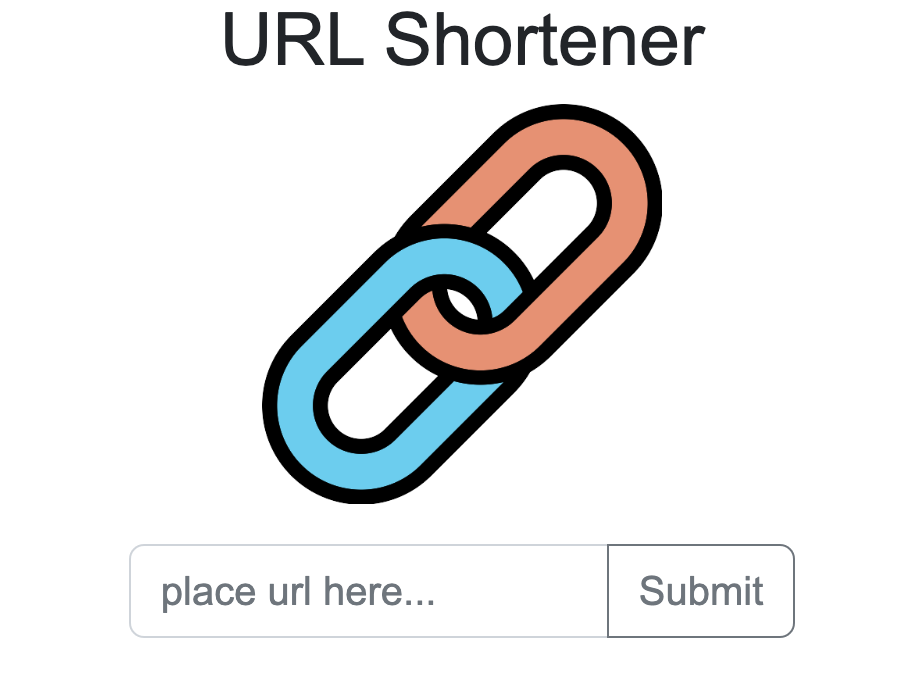

# 短網址產生器


## 介紹
學期2-3(後端), week 4, A11:短網址產生器

### 功能
* 短網址產生器
* 可一鍵複製網址

## 開始使用
* 確認安裝npm, Node.js
* 將專案clone到本地
* 本地開啟後，透過終端機進入資料夾，輸入：```npm install```
* 安裝完畢後，輸入：```npm start```
* 成功的話會在終端機看到：```Express is running on http://localhost:3000```
```mongodb connected!```
* 打開瀏覽器進入：```http://localhost:3000```
* 欲暫停，輸入：```control + c```

## 開發工具
* Node.js 18.12.1
* Express 4.17.1
* Express-Handlebars 4.0.2
* Bootstrap 5.2.3
* mongoose 6.0.7
* dotenv 16.0.3